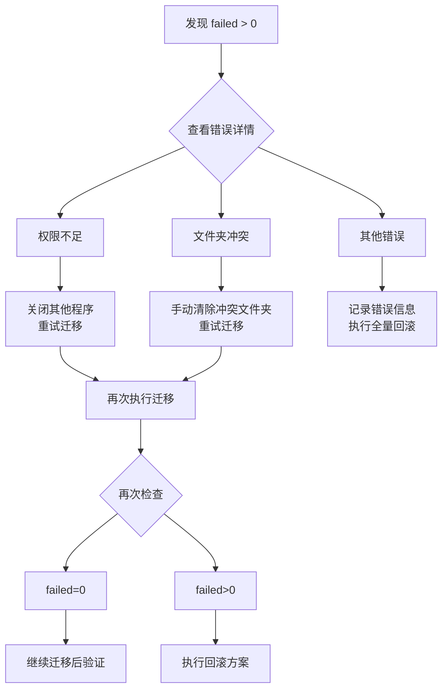

# 生产环境执行计划

> 项目：inovel v0.1.0 | 生成日期：2026-05-05

---

## 1. 执行前准备

### 1.1 构建发布版本

```bash
# 构建正式版本
cd d:\Dev\workspace\2026\05\Rust\inovel
npm run build
npm run tauri build
```

### 1.2 迁移前数据快照

```bash
# 记录迁移前的数据库状态
sqlite3 "%APPDATA%\inovel\inovel.db" ".output pre_migration_snapshot.sql"
sqlite3 "%APPDATA%\inovel\inovel.db" ".dump"
sqlite3 "%APPDATA%\inovel\inovel.db" ".output stdout"

# 记录关键统计
sqlite3 "%APPDATA%\inovel\inovel.db" "
    SELECT '总项目数: ' || COUNT(*) FROM projects
    UNION ALL
    SELECT '待迁移数: ' || COUNT(*) FROM projects WHERE project_id IS NULL OR project_id = ''
    UNION ALL
    SELECT '已迁移数: ' || COUNT(*) FROM projects WHERE project_id IS NOT NULL AND project_id != '';
"
```

**保存快照文件**：`pre_migration_snapshot.sql` 需妥善保管，作为回滚和审计的依据。

---

## 2. 执行检查清单

### 步骤 1：环境确认

| # | 检查项 | 确认方法 | 完成标记 |
|---|--------|---------|---------|
| 1.1 | 确认应用已构建成功 | `npm run tauri build` 无错误 | □ |
| 1.2 | 确认数据库文件存在 | `dir "%APPDATA%\inovel\inovel.db"` | □ |
| 1.3 | 确认数据库可读 | `sqlite3 "%APPDATA%\inovel\inovel.db" "PRAGMA integrity_check;"` | □ |
| 1.4 | 确认磁盘空间充足 | `wmic logicaldisk get size,freespace,caption` | □ |
| 1.5 | 确认项目目录可访问 | 逐个检查 `projects` 表中的 `path` 字段 | □ |
| 1.6 | 记录当前版本号 | `cat package.json | grep version` | □ |
| 1.7 | 记录当前环境 | `systeminfo | findstr /B /C:"OS Name" /C:"OS Version"` | □ |

### 步骤 2：迁移前数据统计

| # | SQL 检查 | 预期 | 实际 |
|---|---------|------|------|
| 2.1 | `SELECT COUNT(*) FROM projects;` | >= 0 | |
| 2.2 | `SELECT COUNT(*) FROM projects WHERE project_id IS NULL OR project_id = '';` | >= 0 | |
| 2.3 | `SELECT COUNT(*) FROM projects WHERE project_id IS NOT NULL AND project_id != '';` | >= 0 | |
| 2.4 | `SELECT COUNT(*) FROM volumes;` | >= 0 | |
| 2.5 | `SELECT COUNT(*) FROM chapters;` | >= 0 | |
| 2.6 | `SELECT COUNT(*) FROM writing_goals;` | >= 0 | |
| 2.7 | `SELECT COUNT(*) FROM characters;` | >= 0 | |
| 2.8 | `SELECT COUNT(*) FROM locations;` | >= 0 | |

### 步骤 3：执行迁移前备份

应用启动后将自动执行 `backup_database()`，但建议手动执行一次以确保：

```bash
sqlite3 "%APPDATA%\inovel\inovel.db" "VACUUM INTO '%APPDATA%\inovel\backups\manual_pre_migration_backup.db';"
sqlite3 "%APPDATA%\inovel\backups\manual_pre_migration_backup.db" "PRAGMA integrity_check;"
```

**确认**：integrity_check 返回 `ok`

### 步骤 4：执行迁移

```bash
# 启动应用
cd d:\Dev\workspace\2026\05\Rust\inovel
npm run tauri dev
```

在 UI 中操作：

1. **检查迁移提示横幅**：在首页顶部显示「发现 N 个项目需要迁移」
2. **点击「查看详情」**：预览待迁移项目列表
3. **确认预览信息无误**：
   - 项目名称正确
   - 项目路径正确
   - 项目数量正确
4. **点击「确认迁移」**：执行实际迁移
5. **观察迁移进度**：
   - 进度条从 25% → 100%
   - 每个项目应有成功/失败反馈
6. **查看迁移结果弹窗**：
   - 确认 `success == total`（全部成功）
   - 记录 `backup_path`
   - 如有 `failed > 0`，查看详情列表中的错误信息

### 步骤 5：迁移后全量验证

#### 5A：数据库验证

```bash
sqlite3 "%APPDATA%\inovel\inovel.db" "

-- V1: 所有项目有 project_id
SELECT 'V1-无project_id项目: ' || COUNT(*) FROM projects 
WHERE project_id IS NULL OR project_id = '';

-- V2: project_id 唯一
SELECT 'V2-ID重复数: ' || COUNT(*) FROM (
    SELECT project_id FROM projects 
    GROUP BY project_id 
    HAVING COUNT(*) > 1
);

-- V3: 路径包含 project_id
SELECT 'V3-路径匹配: OK' FROM projects 
WHERE path LIKE '%' || project_id || '%';

-- V4: 子表数据完整
SELECT 'V4-项目总数: ' || COUNT(*) FROM projects;
SELECT 'V4-卷总数: ' || COUNT(*) FROM volumes;
SELECT 'V4-章总数: ' || COUNT(*) FROM chapters;

-- V5: migration_logs 记录
SELECT 'V5-迁移成功记录: ' || COUNT(*) FROM migration_logs 
WHERE operation='migrate' AND status='success';
SELECT 'V5-迁移失败记录: ' || COUNT(*) FROM migration_logs 
WHERE operation='migrate' AND status='failed';
"
```

#### 5B：文件系统验证

```bash
# 验证所有项目文件夹名与 project_id 一致
sqlite3 "%APPDATA%\inovel\inovel.db" "
    SELECT '检查: ' || name || ' -> ' || project_id || ' @ ' || path 
    FROM projects ORDER BY id;
"

# 对每个项目，验证目录存在
sqlite3 "%APPDATA%\inovel\inovel.db" "
    SELECT '验证: ' || path || ' 存在: ' || (CASE WHEN EXISTS(SELECT 1 FROM projects WHERE path IS NOT NULL) THEN '是' ELSE '否' END)
    FROM projects;
"
```

#### 5C：功能回归验证

| # | 测试项 | 操作 | 预期结果 | 确认 |
|---|--------|------|---------|------|
| R1 | 打开项目 | 点击项目卡片 | 进入编辑器| □ |
| R2 | 查看章节 | 展开卷/章列表 | 内容完整 | □ |
| R3 | 编辑章节 | 修改内容并保存 | 保存成功 | □ |
| R4 | 写作统计 | 查看统计页 | 数据正确 | □ |
| R5 | 项目设置 | 查看项目设置 | 显示项目ID | □ |
| R6 | 新建项目 | 创建新项目 | 使用新ID格式 | □ |
| R7 | 回滚测试 | 点击回滚按钮 | 确认对话框 | □ |
| R8 | 刷新页面 | 重启应用 | 项目列表正常 | □ |

### 步骤 6：处理异常

如果在迁移过程中出现失败项目（`failed > 0`）：



---

## 3. 执行确认书

迁移执行完成后，由执行人逐项确认并签名：

```
┌─────────────────────────────────────────────┐
│           数据迁移执行确认书                    │
├─────────────────────────────────────────────┤
│                                              │
│  项目名称: inovel                             │
│  应用版本: 0.1.0                              │
│  执行日期: ____________                        │
│                                              │
│  ┌─ 迁移前备份 ──────────────────────────┐   │
│  │ 备份路径: ___________________         │   │
│  │ 完整性校验: □ 通过                     │   │
│  └───────────────────────────────────────┘   │
│                                              │
│  ┌─ 迁移结果 ──────────────────────────┐   │
│  │ 总计: _____  成功: _____  失败: _____  │   │
│  └───────────────────────────────────────┘   │
│                                              │
│  ┌─ 迁移后验证 ────────────────────────┐   │
│  │ □ 数据库完整性校验通过                │   │
│  │ □ 所有项目有 project_id              │   │
│  │ □ project_id 无重复                 │   │
│  │ □ 路径与 project_id 一致            │   │
│  │ □ 所有项目文件夹可访问                │   │
│  │ □ 所有子表数据完整                    │   │
│  │ □ 封面图片可显示                      │   │
│  │ □ Git 仓库可操作                     │   │
│  │ □ 新项目创建正常                      │   │
│  └───────────────────────────────────────┘   │
│                                              │
│  执行人签名: ____________                      │
│  确认人签名: ____________                      │
│                                              │
└─────────────────────────────────────────────┘
```

---

## 4. 异常终止方案

若在迁移过程中需要紧急停止：

| 场景 | 操作 | 后果 |
|------|------|------|
| 用户主动取消迁移 | 点击「取消迁移」按钮 | 已完成项目保持迁移状态，未处理项目跳过 |
| 应用崩溃 | 重新启动应用，再次点击迁移 | 幂等设计，已迁移项目自动跳过 |
| 系统关机 | 重启后再次迁移 | 同上，安全重入 |
| 数据明显异常 | 立即关闭应用 → 执行全量回滚 | 恢复到迁移前状态 |

---

## 5. 迁移后清理

迁移验证通过后，执行以下清理：

- [ ] **删除初始备份的快照 SQL 文件**（如 `pre_migration_snapshot.sql`）
- [ ] **保留自动备份**（保留在 `backups/` 目录中，标注日期）
- [ ] **确认回滚脚本可访问**（`rollback_migration` 命令可用）
- [ ] **更新项目文档**（README 等）

---

## 6. 附录：SQLite 快速参考

```sql
-- 完整性检查
PRAGMA integrity_check;

-- 导出为 SQL
.output dump.sql
.dump
.output stdout

-- 数据库统计
SELECT 'projects', COUNT(*) FROM projects
UNION ALL
SELECT 'volumes', COUNT(*) FROM volumes
UNION ALL
SELECT 'chapters', COUNT(*) FROM chapters;

-- 查看 schema
.schema projects

-- 手动备份
VACUUM INTO 'backup_path.db';
```
